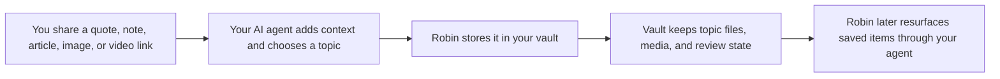

# Robin

Robin is a skill for your AI agent to help you keep a digital commonplace book. When you share something worth remembering, your agent can use Robin to save it in a well-organized vault and bring it back later when it is useful.

> Dedicated to and named for [Robin Williams'](https://en.wikipedia.org/wiki/Robin_Williams) portrayal of Sean Maguire in *[Good Will Hunting](https://en.wikipedia.org/wiki/Good_Will_Hunting)* — a therapist who helped a brilliant but lost young man find his voice.

## What is a Commonplace Book?

A commonplace book[[1](https://ryanholiday.net/how-and-why-to-keep-a-commonplace-book/)][[2](https://en.wikipedia.org/wiki/Commonplace_book)] is a personal collection of ideas, phrases, and passages worth keeping. Traditionally, it is a notebook where one gathers quotations, observations, arguments, anecdotes, and striking turns of phrase from what they read or hear, then organizes them so those pieces can be revisited and used later. 
One of its most practical benefits is that it sharpens vocabulary: by repeatedly noticing, recording, and returning to precise language, a reader begins to absorb better words, clearer sentence patterns, and more nuanced ways of expressing ideas. That expanded command of language tends to improve communication, because stronger vocabulary makes it easier to speak and write with accuracy, persuasion, and confidence. 
Over time, a commonplace book becomes more than a record of reading. It turns into a tool for better thinking, better communication, and, by extension, better work, relationships, and decision-making.

## Features

- Filing — Send Robin any content and it determines the right topic, files it away, and confirms
- Media-aware filing — Local images are copied into the vault, video URLs are stored by reference, and uploaded/local video files are rejected
- Topic management — Creates new topics on demand, suggests topic names, resolves conflicts
- Spaced repetition review — Surfaces items on a configurable schedule so you reinforce learning
- Rating — Rate surfaced items 1–5; Robin tracks what you care about most over time
- Searchable vault — All entries live in plain markdown topic files; open in Obsidian, Logseq, or any editor
- Agent-agnostic — Works with any agent that implements a skills interface

## Before You Start

You need:

- an AI agent that supports local skills
- Python 3.11+
- a local folder where you want your Robin vault to live

## Install Robin With Your Agent

The easiest path is to ask your agent to install Robin for you.

Example prompts:

- `Install the Robin skill from GitHub and make it available in this workspace.`
- `Install the Robin skill from this local folder and set it up for me.`

If your agent needs a repository reference, point it at the Robin repo or local skill directory and ask it to load the skill using its normal local-skill workflow.

## Set Up Robin

Robin is meant to be set up by your agent for you.

Good setup prompts:

- `Set up Robin for my vault at /path/to/my/vault.`
- `Use Robin and create any folders or config files it needs inside my vault.`

During setup, Robin should create:

- `topics/` for topic files
- `media/` for copied images
- `data/robin/robin-config.json` for Robin settings
- `data/robin/robin-review-index.json` for review state

The content lives in your vault. Robin's own state lives in your agent workspace under `data/robin/`.

## Use Robin Through Your Agent

You do not need to talk to Robin through the command line. Just ask your agent to use the skill.

Example prompts:

- `Save this quote using Robin.`
- `Use Robin to store this article under a good topic.`
- `Use Robin to save this image and include the author and context.`
- `Review my Robin items.`
- `What has Robin saved about clear thinking?`

For media items, your agent should provide:

- `description` for every entry
- `creator`, `published_at`, and `summary` for image and video entries

## What Robin Stores

Inside your vault, Robin stores:

- topic files under `topics/`
- copied images under `media/<topic>/`

Inside the agent workspace, Robin stores:

- `data/robin/robin-config.json`
- `data/robin/robin-review-index.json`

Robin stores content and review state. Your agent is still responsible for choosing the topic, adding useful context, and deciding when to save or resurface something.

If your agent supports file indexing, it should include Robin's topic files in its searchable corpus. Use your agent's normal search for broad recall, and use `robin-search` when Robin-specific structured lookup is needed.

## Need More Detail?

See [docs/guide.md](docs/guide.md) for the advanced guide, including:

- file format and media rules
- vault layout and runtime behavior
- CLI usage and manual workflows
- review/index behavior
- host-specific examples
- troubleshooting and compatibility notes

## License

MIT — see [LICENSE](LICENSE)
